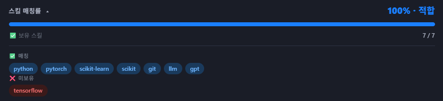

# Job Skill Matcher

A Chrome extension that analyzes job postings and shows how well your skills match — built during my own job search.

## Background

I've been applying to AI engineer positions for a while. At some point I started wondering why I kept getting rejected, and one hypothesis was skill mismatch — applying to jobs that required things I didn't have, or missing jobs that were actually a good fit.

Manually reading through every posting to check was slow. So I built this to surface the match at a glance and move on.

## What it does

- Detects required skills from job postings on **Wanted** and **Saramin**
- Compares them against a predefined personal skill set
- Shows a match rate badge at the top of the posting
- Click the badge to see which skills matched and which didn't

## Skills tracked

| Category | Skills |
|----------|--------|
| AI / ML | RAG, BM25, LangChain, LangGraph, LangSmith, Prompt Engineering, Fine-tuning, LoRA, GGUF, Vector Search, Hybrid Search, HuggingFace, Ollama |
| Frameworks | PyTorch, scikit-learn, LightGBM, Streamlit, FastAPI |
| Data | Python, Pandas, NumPy |
| Infra | Docker, Redis, ChromaDB, Git |
| Evaluation | RAGAS, LangSmith |

## Installation (local)

1. Clone this repo
2. Go to `chrome://extensions`
3. Enable **Developer mode**
4. Click **Load unpacked** and select the repo folder

## Roadmap

- [ ] Saramin support (in progress)
- [ ] Editable skill list via popup UI
- [ ] Highlight matched keywords inline in the job description
